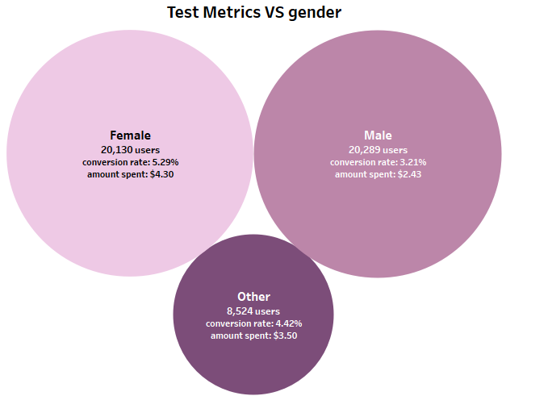
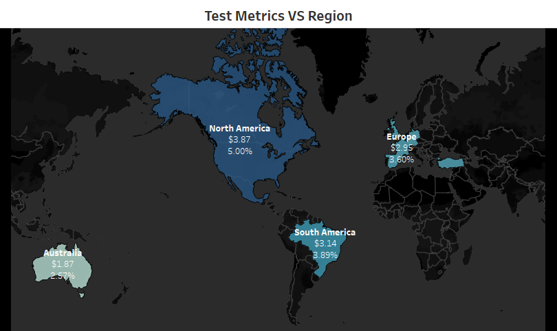

# A/B Test Report: Food and Drink Banner

## Purpose
We need to check if the new food & drinks banner on the landing page is more profitable than the regular landing page of our GloBox app.

## Hypotheses
H0 - mu_control = mu_alternative
H1 - mu_control != mu_alternative

## Methodology
### Test Design
- **Population:** We separated the visitors randomly into 2 groups:  
Control group - 24,343 users, Test group - 24,600 users.

- **Duration:** The test conducted from the 25/01/2023 until 06/02/2023.

- **Success Metrics:** We want to measure success by comparing the conversion rate and the average amount spent for each group.

## Results
### Data Analysis
- **Pre-Processing Steps:** We performed pre-processing steps on the dataset, including cleaning and filtering out certain parameters such as user ID, user country, gender, device type (IOS/Android), test group (control/treatment), and user conversion status (1 for converted, 0 for not converted). We also removed any null values from the dataset using Beekeeper before transforming it into Tableau.

I used 2 SQL queries to analysis the dataset.

The first query is for basic analysis.

```SQL

SELECT u.id AS user_id, 
	u.country AS user_country, 
       CASE WHEN u.gender = 'M' THEN 'Male' WHEN u.gender = 'F' THEN 'Female' ELSE 'Other' END AS gender,
       CASE WHEN g.device = 'I' THEN 'IOS' WHEN g.device = 'A' THEN 'Android' ELSE 'Other' END AS ios_or_android, 
       CASE WHEN g.group = 'A' THEN 'Control Group' ELSE 'Treatment Group' END AS test_group,
	SUM(COALESCE(a.spent, 0)) AS sum_money_spent,
       CASE WHEN a.spent IS NOT NULL THEN 1 ELSE 0 END AS conv_or_not
FROM users AS u
LEFT JOIN groups AS g
       ON g.uid = u.id
LEFT JOIN activity AS a
       ON a.uid = u.id
GROUP BY user_id, user_country, gender, ios_or_android, test_group, conv_or_not
ORDER BY sum_money_spent DESC

```
The second query is for advanced tasks.

``` SQL

SELECT u.id, 
	g.group, 
       g.join_dt,
       a.dt, 
       a.spent, 
       CASE WHEN a.spent is not null THEN 1 ELSE 0 END AS converted
FROM users AS u
LEFT JOIN groups AS g
       ON g.uid = u.id
LEFT JOIN activity AS a
	ON a.uid = u.id

```

- **Statistical Tests Used:** To check the difference in conversion rate I used a
                              Z-test - to test percentage.
                              To check the difference in the average amount spent I used a T-test - to test means.

- **Results Overview:** 
                        Based on the results of the conversion rate z-test, it has been found that there is a significant difference between the control and treatment groups. The P-value is 0.0001, which is less than the significance level of 5%. Therefore, it is recommended to reject the null hypothesis and launch the banner to all app users.

The conversion rate for the control group is found to be 3.92%, while the treatment group has a conversion rate of 4.63%. This represents a difference of 0.71% between the groups, and the results provide hard evidence that there is a significant difference between them.


                        Based on the T-test analysis of the average amount spent, it has been found that there is no significant difference between the control and treatment groups. The P-value of 0.9439 is greater than 5%, indicating that we failed to reject the Null hypothesis. Therefore, it is recommended not to launch the new banner.

The control group has an average amount spent of $3.37, while the treatment group has an average amount spent of
$3.39. This indicates that there is no significant difference between the two groups.


### Findings

## Interpretation
- **Outcome of the Test(s):** The results of the tests are inconsistent. The test for the conversion rate rejects the null hypothesis, indicating that we should launch the new banner. However, the test for the amount spent fails to reject the null hypothesis and advises us not to launch the new banner.

- **Confidence Level:** 
95% Confidence Interval for the Difference in Conversion Rates: (0.0035, 0.0107).
95% Confidence Interval for the Difference in Average Amount Spent per User: (-0.4386, 0.4713).

## Conclusions
- **Key Takeaways:** We have observed an increase in the conversion rate between the test groups due to the new food & drinks banner, but it hasn't affected the users to spend a larger amount of money each time.
We also observed that with the time going on - the conversion rate is consistently increasing on treatment group, on the other hand we see unstable average amount spent over time. we will need to keep monitoring it,
 
- **Limitations/Considerations:** The test lasted only two weeks, and the results are not clear in one direction. Another limitation is the sample size. 
The control group had 24,343 users, and the treatment group had 24,600 users, while the power analysis shows that we need at least 314,000 total users to ensure that the test is powerful enough to detect the difference. Therefore, we need to keep monitoring the banner result with further analysis.


## Recommendations
- **Next Steps:** Based on the analysis results, I recommend launching the new food & drinks banner. Although there was no significant impact on the average amount spent per user, the treatment group showed a substantial increase in the conversion rate. This indicates that the new banner has a positive effect on user engagement and conversion, which is expected to lead to increased revenue for the company.

- **Further Analysis:** However, it's crucial to acknowledge the limitations associated with the sample size and potential biases in the data despite the promising results of the A/B test. Therefore, I recommend closely monitoring key metrics after the launch and conducting further analyses as necessary to validate the findings and optimize the effectiveness of the new banner.


## Visualizations
- **Novelty Effects:**
The graph displays that over time we see consistently slowly increase on conversion rate for the treatment group. However, on the average amount spent we see unstable amount. We need to keep monitoring it to see if the effectiveness of the banner on the costumers.


- **Confident Intervals:**
95% Confidence Interval for the Difference in Conversion Rates:


95% Confidence Interval for the Difference in Average amount spent:


- **Metrics per Group:**
The graph display average amount of money spent, and conversion rate per test group.


- **Dist. amount spent per user per group:**
Here we observe that users exposed to the new banner are making larger purchases. However, it's important to note that the sample size is small, emphasizing the need for continued analytics.


- **Metrics per Device:**
The graph displays the test metrics per device, showing that iPhone users are spending more money in the app.


- **Metrics per Gender:**
The graph displays the test metrics per gender, indicating that female users are spending more money in the app.


- **Metrics per Country:**
Conversion rate and average amount spent per country.


- **Metrics per Region:**
Conversion rate and average amount spent per region.

